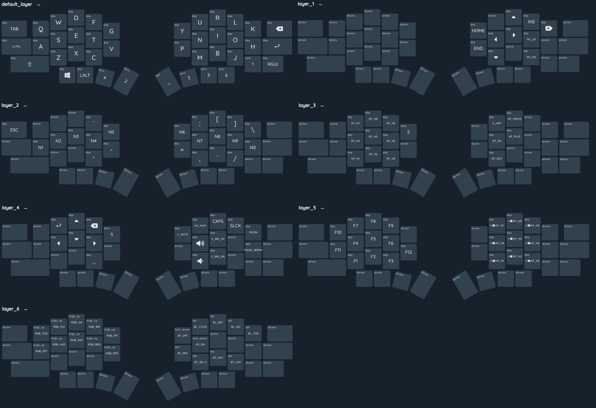

# ZMK-Config-Jmpax40

This is Jmpax40 config for the ZMK keymap editor

- Use [https://nickcoutsos.github.io/keymap-editor](https://nickcoutsos.github.io/keymap-editor) to  modify keymap.
- Due to my keyboard not being in the official ZMK repository, you can **not** use Actions in Github to build firmware. 

# Keymap Preview

